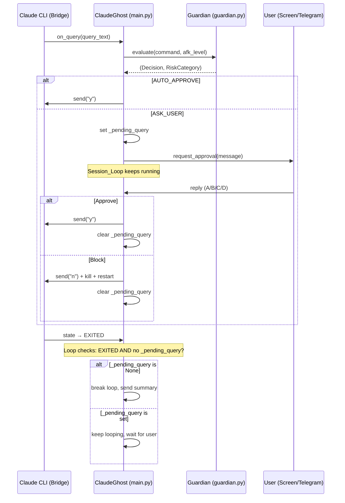

# Design Document: AFK Level Enforcement

## Overview

This design addresses three bugs in ClaudeGhost's session supervision system that allow the agent to bypass AFK level enforcement:

1. **`_run_loop()` exits prematurely**: When `bridge.state == CliState.EXITED`, the loop breaks immediately even if `_pending_query` is set.
2. **`_handle_reply_inner()` discards replies**: When the bridge is `EXITED`, user replies are silently ignored, so approval responses are never processed.
3. **No blocking between ASK_USER and CLI exit**: The ASK_USER path sends a notification but nothing prevents the session from completing before the user responds.

The fix is surgical: modify the exit condition in `_run_loop()` to also check `_pending_query`, and modify the early-return guard in `_handle_reply_inner()` to allow replies when a pending query exists. No changes to `guardian.py` or `bridge.py` are needed — the autonomy matrix and command classification are correct.

## Architecture

The existing architecture is sound. The components involved are:



The bug is entirely in `ClaudeGhost` (main.py). The Guardian correctly returns `ASK_USER`, and the Bridge correctly reports `EXITED`. The problem is that `ClaudeGhost` doesn't respect the pending query state when deciding whether to exit.

## Components and Interfaces

### Modified: `ClaudeGhost._run_loop()` (src/main.py)

**Current behavior** (buggy):
```python
if (
    self._bridge.state == CliState.EXITED
    and not self._budget_paused
    and not self._restarting
):
    self._session_completed = True
    break
```

**Fixed behavior**:
```python
with self._pending_lock:
    has_pending = self._pending_query is not None

if (
    self._bridge.state == CliState.EXITED
    and not self._budget_paused
    and not self._restarting
    and not has_pending
):
    self._session_completed = True
    break
```

The only change is adding `and not has_pending` to the exit condition. This ensures the loop continues running (processing screen notifications, checking for user input) while a query is pending.

### Modified: `ClaudeGhost._handle_reply_inner()` (src/main.py)

**Current behavior** (buggy):
```python
if (
    self._bridge is not None
    and self._bridge.state == CliState.EXITED
    and not self._budget_paused
    and not self._restarting
):
    return
```

**Fixed behavior**:
```python
with self._pending_lock:
    has_pending = self._pending_query is not None

if (
    self._bridge is not None
    and self._bridge.state == CliState.EXITED
    and not self._budget_paused
    and not self._restarting
    and not has_pending
):
    return
```

Same pattern: allow reply processing when a pending query exists, even if the bridge has exited.

### Modified: `ClaudeGhost._handle_reply_inner()` — Approve path when bridge is EXITED

When the user approves (reply "A") but the bridge has already exited, sending "y" to a dead bridge is pointless. The approve path should handle this gracefully:

```python
# ── A: Approve ──────────────────────────────────
if first_char == "A":
    ghost_status.add_log("[green]User APPROVED action.[/green]")
    ghost_status.stats.record_user_approve()
    with self._pending_lock:
        approved_cmd = self._pending_query
        self._pending_query = None
    if approved_cmd:
        self._changelog.add_command(approved_cmd)
    # Only send "y" if bridge is still alive
    if self._bridge and self._bridge.state != CliState.EXITED:
        self._bridge.send("y")
    ghost_status.state = "RUNNING"
```

### Unchanged: `guardian.py`

No changes needed. The autonomy matrix and `evaluate()` function are correct. The bug is in how `main.py` handles the `ASK_USER` decision, not in the decision itself.

### Unchanged: `bridge.py`

No changes needed. The bridge correctly reports `CliState.EXITED` when the CLI process terminates.

## Data Models

No new data models are introduced. The existing fields are sufficient:

- `_pending_query: Optional[str]` — Already exists, holds the command awaiting approval.
- `_pending_lock: threading.Lock` — Already exists, protects `_pending_query` access.
- `_restarting: bool` — Already exists, prevents premature exit during bridge restart.
- `_budget_paused: bool` — Already exists, prevents exit during budget pause.

The fix reuses these existing fields. The only change is that `_pending_query` is now checked in two additional places: the `_run_loop` exit condition and the `_handle_reply_inner` early-return guard.


## Correctness Properties

*A property is a characteristic or behavior that should hold true across all valid executions of a system — essentially, a formal statement about what the system should do. Properties serve as the bridge between human-readable specifications and machine-verifiable correctness guarantees.*

### Property 1: Session loop does not exit while a pending query exists

*For any* non-None `_pending_query` value, when the bridge state is `EXITED` and `_budget_paused` is False and `_restarting` is False, the session loop exit condition SHALL evaluate to False (i.e., the loop continues running).

**Validates: Requirements 1.1, 1.3**

### Property 2: Reply handler processes replies when a pending query exists despite EXITED bridge

*For any* valid reply string (starting with A, B, C, or D) and *for any* non-None `_pending_query` value, when the bridge state is `EXITED`, the reply handler SHALL NOT return early — it SHALL process the reply and modify `_pending_query` or session state accordingly.

**Validates: Requirements 2.1**

### Property 3: Autonomy matrix correctness across all AFK levels

*For any* AFK level in {1, 2, 3, 4, 5} and *for any* command string, the Decision returned by `evaluate(command, level)` SHALL match the expected decision from the autonomy matrix for the classified Risk_Category of that command.

**Validates: Requirements 3.1, 3.2, 3.3, 3.4, 3.5**

### Property 4: ASK_USER decision sets pending query and sends notification

*For any* command where `evaluate()` returns `ASK_USER`, calling `_handle_query_inner()` with a query containing that command SHALL result in `_pending_query` being set to a non-None value and an approval notification being queued.

**Validates: Requirements 4.1**

### Property 5: No premature CLI response while pending query is set

*For any* command where `evaluate()` returns `ASK_USER`, between the time `_handle_query_inner()` sets `_pending_query` and the time the user responds, the bridge's `send()` method SHALL NOT be called with "y" or "n" for that command.

**Validates: Requirements 4.2**

## Error Handling

### Bridge exits during pending query

When the bridge transitions to `EXITED` while `_pending_query` is set, the session loop continues. The user can still respond:
- **A (Approve)**: Clears `_pending_query`, logs the command, but does NOT send "y" to the dead bridge. The loop then exits normally.
- **B (Block)**: Clears `_pending_query`, restarts with a new bridge instance.
- **D (Detonate)**: Clears `_pending_query`, terminates the session.

### Bridge is None

The existing guard `if self._bridge is None and not self._budget_paused: return` in `_handle_reply_inner` is preserved. The new `has_pending` check is added to the separate EXITED guard, not the None guard.

### Thread safety

All reads and writes to `_pending_query` are protected by `_pending_lock`. The new checks in `_run_loop` and `_handle_reply_inner` acquire the lock before reading `_pending_query`.

## Testing Strategy

### Testing Framework

Use `pytest` with `unittest.mock` for mocking the bridge, screen notifier, and telegram bot. Use `hypothesis` for property-based testing.

### Unit Tests

Unit tests cover specific examples and edge cases:
- Session loop exits when bridge is EXITED and no pending query (Req 1.2)
- Reply handler discards replies when bridge is EXITED and no pending query (Req 2.2)
- Approve clears pending query and allows exit when bridge is EXITED (Req 2.3)
- Approve sends "y" to bridge (Req 4.3)
- Block sends "n", kills bridge, restarts (Req 4.4)
- Detonate kills bridge, terminates session (Req 4.5)
- Level 1 triggers approval for a "create test.md" write command (Req 5.5)

### Property-Based Tests

Property-based tests use `hypothesis` to verify universal properties across generated inputs. Each property test runs a minimum of 100 iterations.

- **Feature: afk-level-enforcement, Property 1: Session loop does not exit while a pending query exists** — Generate random pending query strings, verify loop exit condition is False when bridge is EXITED.
- **Feature: afk-level-enforcement, Property 2: Reply handler processes replies when pending query exists despite EXITED bridge** — Generate random reply strings (A/B/C/D prefixed) and random pending query values, verify reply is processed.
- **Feature: afk-level-enforcement, Property 3: Autonomy matrix correctness across all AFK levels** — Generate random AFK levels (1-5) and random commands from each risk category, verify the decision matches the matrix.
- **Feature: afk-level-enforcement, Property 4: ASK_USER decision sets pending query** — Generate random commands that would trigger ASK_USER at various levels, verify _pending_query is set after _handle_query_inner.
- **Feature: afk-level-enforcement, Property 5: No premature CLI response while pending** — Generate random ASK_USER commands, verify bridge.send is not called with "y" or "n" during _handle_query_inner.

### Test Configuration

```python
from hypothesis import given, strategies as st, settings

@settings(max_examples=100)
```

Each test is annotated with a comment referencing its design property:
```python
# Feature: afk-level-enforcement, Property 3: Autonomy matrix correctness across all AFK levels
```
